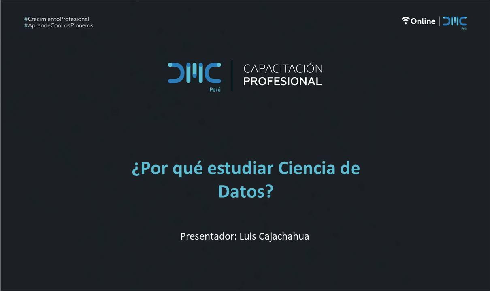

# Webinar DMC: ¿Por qué estudiar Ciencia de Datos?

Materiales del Webinar del 09-Jun-2022

Puedes descargar la presentación haciendo clic derecho y eligiendo la opción "Descargar Como.." en este [ENLACE](docs/Modelos_en_Produccion.pdf)

Y desde aquí puedes acceder a la [grabación](https://www.facebook.com/datamining.pe/videos/561460648936273) en Facebook:

# Referencias:

1. ‘Big data’ o cómo el trabajo más sexi venció a todas las modas
https://retinatendencias.com/negocios/big-data-o-como-el-trabajo-mas-sexi-vencio-a-todas-las-modas/

2. ¿Qué es un científico de datos y por qué se dice que es el trabajo con mayor demanda?
https://www.ey.com/es_sv/consulting/analytics-consulting-services/cientifico-de-datos-trabajo-con-mayor-demanda

3. La Analítica de Datos como competencia transversal en las Empresas
https://www.youtube.com/watch?v=TapJ7EFYSGk&t=2475s

4. Preocupa la alta escasez de científicos de datos
https://www.itmastersmag.com/noticias-analisis/preocupa-la-alta-escasez-de-cientificos-de-datos/

5. Analítica 2022: Estados Unidos será el agujero negro del talento
https://www.linkedin.com/pulse/anal%C3%ADtica-2022-estados-unidos-ser%C3%A1-el-agujero-negro-ospina-arango/

6. 5 Razones para NO ser un Data Scientist
https://www.youtube.com/watch?v=SqCN8Etc-RA

7. To Be More Effective with Data Science, Hire Fewer Data Scientists
https://techno-sapien.com/blog/hire-fewer-data-scientists
